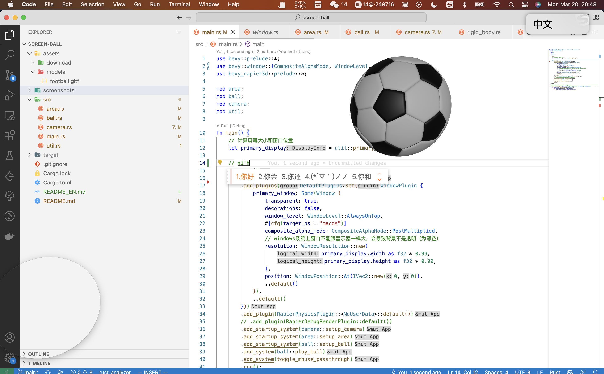

[English](README_EN.md)

# screen-ball 屏幕踢球游戏
- [x] 足球运动模拟
- [x] 鼠标控制踢球
- [x] 3d模型载入
- [x] 鼠标输入等事件落入下面窗口
- [ ] 多显示器支持（卡在[bevyengine/bevy#7600](https://github.com/bevyengine/bevy/issues/7600) 和 [bevyengine/bevy#7975](https://github.com/bevyengine/bevy/issues/7975)）

## 运行
1. 本地运行
```
cargo run
```

## 游戏展示
视频演示：[B站](https://www.bilibili.com/video/BV1f84y1g75K)


## 参考资料
1. 概念来自 Bevy Discord 社区 PaulH#7052 发布的视频 [beach_ball.webm](https://user-images.githubusercontent.com/17514693/210358262-19bf32ef-b4f2-42a9-833e-4b9349816532.webm)
2. [bevy_rapier 文档](https://rapier.rs/docs/user_guides/bevy_plugin/getting_started_bevy)
3. [Online 3D Viewer](https://www.creators3d.com/online-viewer)